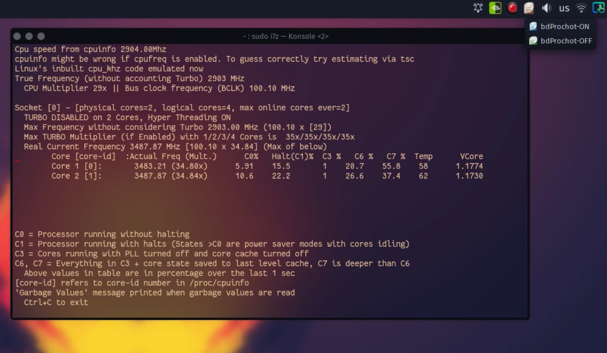

#DESCRIPTION
this app disables any kind of throttling applied on intel processor laptops 
and unlocks full power without turbo boost on battery
its all neatly developed in a system tray menu with 2 simple options on and off

there is an option to enable turbo boost without throttling but this will pump the CPU to the max turbo frequency and lead to over power consumption
 from the battery which will result in  instant shutdown or crash and it`s even more pronounced on Optimus enabled hybrid Nvidia GPUs,
 and Lenovo laptops (many of which have extremely low performance on battery due to the factory throttling over power consumption) 


the app is intended to be used as follows bdprochot_on when plugged in and bdprochot_off when you are throttling on battery





#INSTALLATION

step 1:
FOLLOW THE COMMANDS


```shell
sudo apt install msr-tool
```
or if you are on arch based distro sudo //  pacman -S msr-tools  \\

```shell
sudo modprobe msr
```


```shell
sudo ./install.sh
```

enable anti_throttle as service

```shell
sudo systemctl daemon-reload 
```
```shell
sudo systemctl enable anti_throttle.service 
sudo systemctl start anti_throttle.service
```


optionally verify if the script is up and running as a systemd service.
```shell
sudo systemctl status shellscript.service 
```

the installation procees copys the app to /usr/bin and meke`s it a service 


step 2 - if it works, step 2 is optional :

install performance-tweaks package from the Chaotic AUR repository https://archlinux.pkgs.org/rolling/chaotic-aur-x86_64/performance-tweaks-1.0.1-1-any.pkg.tar.zst.html  

a regular // pacman -S \\  shoud also do the trick if you have the repo


IMPORTANT:
if you have: tlp , auto-cpufreq , intel-undervolt or powersaving-tweaks  installed as packages or enabled in system assistant please uninstall them 
you should also check the power scaling government of your distro in the  settings (and of course set it to performance )


#enable turbo boost on battery (extremely dangerous) do at your own risk 

just remove the last line of eath of  the 2 files: bdprochot_off.sh , bdprochot_on.sh

the line looks this way: 
```shell 
echo 1 > /sys/devices/system/cpu/intel_pstate/no_turbo 
```


#how it works

my package gives you the option to turn off "bi-directional prochot" which allows the CPU to ignore all motherboard throttling instructions.
In the process of doing so the system may become unstable, that’s why my app disables turbo boost when BdProchot is off.

If  for some reason you need your CPU fully unthrottled (no thermal throttling , no p state , no speed step restrictions )  but tj max is working, so if you hit 98°C it will shutdown immidiatly
you can follow the steps to enable turbo boost when bd prochot is off
but do at your own risk because if your laptop doesn’t have a max power consumption cut off on battery:
A: you may start your laptop on fire (or at least damage the battery)
B: damage your CPU 

the chances of this happening are really slim, and the most likely thing that is going to happen is a crash or shutdown


big thanks to https://github.com/yyearth

soon I will develop a version 2 which will detect if the ac power is plugged in and eliminate the need for user interaction

